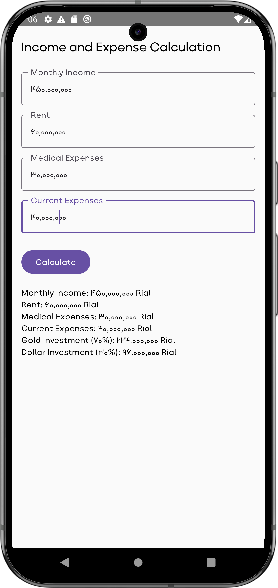

# Personal Money Management App

This app helps users manage their finances by calculating and splitting their income into categories like rent, medical expenses, and investments (gold and dollar).





### Features:
- Input monthly income, rent, medical expenses, and other expenses.
- Automatically calculates remaining income after deducting expenses.
- Allocates remaining funds into gold (70%) and dollar (30%) investments.
- Displays results with formatted financial details.

### How to Run the App:
1. Clone the repository:
   ```bash
   git clone https://github.com/your-username/personal-money-management.git
